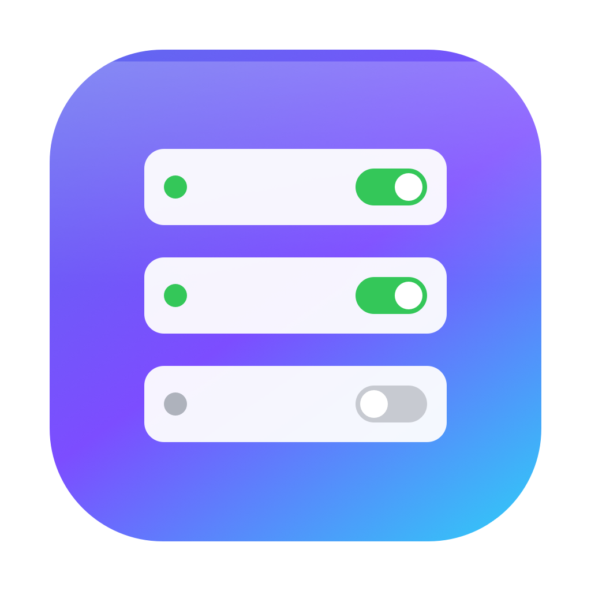

<div align="center">



# MCP Manager

**A native macOS app for safely managing the MCP servers in your Claude configs.**

[](https://github.com/Artemu/claude-mcp-server-manager/actions/workflows/build.yml)
[](https://github.com/Artemu/claude-mcp-server-manager/releases/latest)
[](LICENSE)
[](#requirements)

</div>

---

## Why

Editing `claude_desktop_config.json` by hand is error-prone — one missing comma or brace and Claude silently fails to load your MCP servers. And there's no built-in way to *temporarily disable* a server without deleting its whole config (including tokens and args you'd have to re-enter later).

**MCP Manager** fixes both:

- It edits the config **for** you, so the JSON is always valid.
- It lets you **enable/disable** servers with a toggle, keeping disabled ones safely stored.
- It can keep **Claude Desktop** and **Claude CLI** (and any other config you point it at) **in sync**.
- It only ever touches the `mcpServers` section — everything else in your config is preserved byte-for-byte, with a timestamped backup before every write.

## Features

- 🗂 **Server library** — every server (enabled *and* disabled) lives in a single `mcp-directory.json`, the app's source of truth.
- 🔀 **Enable / disable** — toggle a server on or off without losing its configuration.
- 🔄 **Multi-config sync** — manage Claude Desktop, Claude CLI, and any other JSON config with an `mcpServers` section; managed configs are kept in sync.
- 🧩 **Form editor** — edit servers with structured fields (transport, command, args, env, URL, headers) — no JSON required.
- `{}` **Raw JSON fallback** — switch to raw JSON anytime. Configs the form can't represent (e.g. `oauth`) automatically stay in raw mode so nothing is ever silently dropped.
- 🛟 **Safety first** — atomic writes, JSON validation before saving, and automatic timestamped backups (last 25 kept per file).
- ✅ **Live feedback** — a transient confirmation appears whenever changes are written to disk.

## Supported config schema

The form editor implements the documented MCP server schema:

| Transport | Required | Optional |
|-----------|----------|----------|
| **Local (stdio)** | `command` | `args` (string[]), `env` (string→string) |
| **HTTP / SSE / WebSocket** | `type`, `url` | `headers` (string→string) |

Anything outside this (e.g. an `oauth` object, or non-string `env` values) is fully supported via the **Raw JSON** editor — the app just won't try to render it as a form.

Example (`stdio`):

```json
{
  "command": "npx",
  "args": ["-y", "@modelcontextprotocol/server-filesystem", "/Users/me/Desktop"],
  "env": { "LOG_LEVEL": "info" }
}
```

Example (`http`):

```json
{
  "type": "http",
  "url": "https://mcp.example.com/mcp",
  "headers": { "Authorization": "Bearer ..." }
}
```

## Requirements

- macOS 14 (Sonoma) or later
- [Xcode](https://developer.apple.com/xcode/) 15+ / Swift 5.9+ command-line tools (only needed to **build** from source)

## Install

### Download a release

Grab the latest `MCP-Manager-vX.Y.Z.app.zip` from the
[**Releases**](https://github.com/Artemu/claude-mcp-server-manager/releases/latest) page,
unzip it, and move `MCP Manager.app` into `/Applications`.

### Build from source

```bash
git clone git@github.com:Artemu/claude-mcp-server-manager.git
cd claude-mcp-server-manager

make app          # builds "build/MCP Manager.app"
make run          # builds and launches it
```

To use it day-to-day, copy the bundle into Applications:

```bash
cp -R "build/MCP Manager.app" /Applications/
```

> The app is **ad-hoc code-signed**. The first time you open it, macOS may warn that it's from an unidentified developer — right-click the app and choose **Open**, or allow it under **System Settings → Privacy & Security**.

## Usage

1. **First launch** asks which configs to manage — Claude Desktop (always) and, optionally, Claude CLI kept in sync. This is saved and can be changed later via the ⚙️ button.
2. **Toggle** any server on/off from the sidebar or the detail pane — they stay in sync, and the change is written immediately.
3. **Add a server** with the **+** button. Edit it with the **Form** or **Raw JSON** tabs.
4. **Manage configs** via the ⚙️ button — toggle which files are synced, or **Add Config…** to point at any other JSON file with an `mcpServers` section (e.g. a project `.mcp.json`).

## File locations

All app data lives next to your Claude Desktop config, in
`~/Library/Application Support/Claude/`:

| File | Purpose |
|------|---------|
| `claude_desktop_config.json` | Claude Desktop's config (managed) |
| `~/.claude.json` | Claude CLI's config (managed, if enabled) |
| `mcp-directory.json` | The app's server library (source of truth) |
| `mcp-manager-settings.json` | Which configs are managed |
| `mcp-manager-backups/` | Timestamped `.bak` copies made before every write |

> ⚠️ **Security note:** MCP server configs often contain secrets (API tokens) in plaintext — that's how the Claude configs already store them. Be aware that `mcp-directory.json` and the backups are additional plaintext copies on disk in your user-only Application Support folder.

## Development

Project layout:

```
Sources/MCPManager/
  MCPManagerApp.swift     App entry point
  ContentView.swift       Main window: sidebar + detail + toast
  EntryEditor.swift       Server editor (Form/Raw modes) + JSON text view
  ConfigFormView.swift    Structured form fields
  ServerConfigForm.swift  Schema model + parse/serialize + representability
  ConfigStore.swift       Load/reconcile/persist, sync, atomic writes, backups
  Models.swift            Server, directory, settings, managed-config types
  JSONValue.swift         Order/loss-tolerant JSON value used to preserve configs
  OnboardingView.swift    First-run config selection
  SettingsView.swift      Managed-configs settings
```

Common tasks:

```bash
make            # list all targets
make build      # debug build
make check      # release build (CI uses this)
make app        # build the .app bundle
make icon       # regenerate the app icon
make clean      # remove build artifacts
```

## Continuous integration

[`.github/workflows/build.yml`](.github/workflows/build.yml) builds the app on every push and pull request to `main` (and on demand), then uploads the packaged `MCP Manager.app` as a downloadable artifact.

## Versioning & releases

The project follows [semantic versioning](https://semver.org). The app's version
is derived at build time from the latest git tag (e.g. tag `v1.2.3` →
`CFBundleShortVersionString` `1.2.3`), and the build number is the commit count.
The current version is shown at the bottom of the sidebar.

To cut a release:

```bash
git tag -a v1.2.3 -m "Release v1.2.3"
git push origin v1.2.3
```

Pushing a `v*` tag triggers [`release.yml`](.github/workflows/release.yml), which
builds the app and publishes a GitHub Release with the packaged
`MCP Manager.app` attached and auto-generated notes.

## License

Source-available under the **MCP Manager License (No-Resale)** — free for anyone, including companies, to use, modify, and share (including commercial/internal use), **but no resale**. See [LICENSE](LICENSE) for the full terms.

> This is not an OSI-approved open-source license (the no-resale clause is a use restriction). It is not legal advice.
